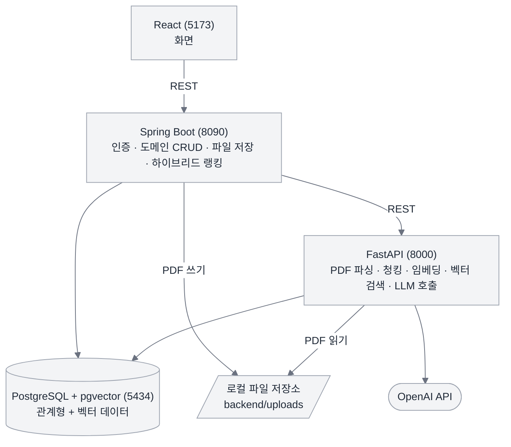
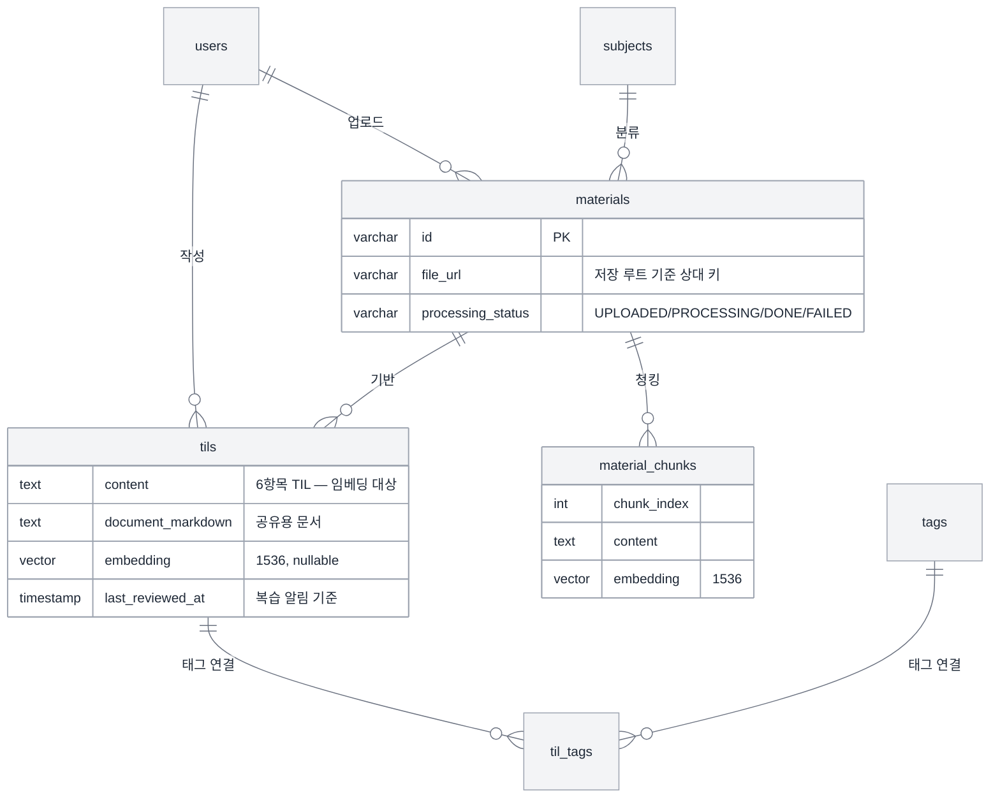

# 📚 TILink


<br>

학습자료 PDF를 올리면 AI가 일관된 형식의 TIL 초안을 만들고, 임베딩 유사도와 태그를 결합해
과거 학습 기록과 연결해 주는 서비스입니다.

---

## 기획 의도

SKALA 교육 과정은 짧은 기간에 많은 기술을 다루고, 매 수업마다 방대한 양의 교안 PDF가 쌓입니다.
생성형 AI로 정리할 수는 있지만 세 가지가 반복됩니다.

| 문제 | TILink 의 해결 |
|---|---|
| 교안이 많아 TIL 정리에 시간이 오래 걸린다 | 업로드하면 AI가 핵심을 뽑아 초안을 만든다 |
| 매번 같은 프롬프트를 다시 쓰고, 결과 형식이 매번 다르다 | TIL 템플릿을 Structured Output 스키마로 서비스에 내장해 항상 같은 구조로 받는다 |
| 예전에 배운 내용이 다시 나와도 과거 기록을 찾기 어렵다 | 본문 임베딩 + 태그 하이브리드 랭킹으로 관련 과거 TIL을 함께 보여준다 |

핵심은 AI가 대신 글을 써준다는 것이 아니라 **학습 기록을 계속 쌓고 다시 꺼내 쓰게 만드는 것**입니다.

---

## 주요 기능

### 1. 학습자료 관리
PDF 업로드 → 과목별 분류 → 처리 상태 확인(`업로드됨` / `분석중` / `완료` / `실패`).
업로드가 커밋되면 FastAPI 에 분석을 요청하고, 파싱 → 청킹 → 임베딩 → `material_chunks` 저장까지
백그라운드로 진행됩니다.

### 2. AI TIL 초안 생성
자료의 청크를 컨텍스트로 넣어 **한 번의 LLM 호출로 두 형식을 함께** 만듭니다.

- **TIL 기록** — 기획서의 6항목 템플릿 (오늘 배운 내용 / 핵심 개념 / 실습 내용 + 회고 3항목).
  저장되는 학습 기록이고, **임베딩도 이 값으로 만듭니다.** 짧고 밀도가 높아 유사도 비교에 유리합니다.
- **공유 문서** — 제목 + 목차 + 주제별 섹션(표·코드블록 포함). velog·티스토리에 붙여넣는 용도입니다.


### 3. TIL 관리
작성·수정·삭제, 기간·과목·태그 필터 조회, 태그 관리, 원본 자료 연결.
상세를 여는 시점에 최종 열람 일시가 갱신됩니다.

### 4. 관련 학습 조회
현재 TIL과 내용이 겹치는 과거 기록을 찾아줍니다.

```
최종 점수 = 0.7 × 코사인 유사도(pgvector) + 0.3 × 태그 자카드 유사도
```

벡터만 쓰면 표현이 비슷한 글이 걸리고, 태그만 쓰면 태그를 안 단 기록을 놓칩니다.
두 신호를 섞고, 화면에는 **유사도와 겹친 태그를 함께** 보여줘서 왜 관련 있는지 드러냅니다.

### 5. 복습 알림
7일 이상 다시 열어보지 않은 TIL 을 오래 묵은 순으로 보여줍니다.
**별도 배치·스케줄러 없이** 조회 시점에 `coalesce(last_reviewed_at, created_at)` 기준으로 경과일을 계산합니다.

### 6. 학습 대시보드
로그인 후 첫 화면입니다. 통계 4카드 / 최근 TIL / 최근 학습자료 / 관련 학습 미리보기 / 과목별 학습 기록.

---

## 시스템 구조



**역할 분담**

- **Spring Boot** — 인증(JWT), 도메인 CRUD, 파일 저장, 태그, 복습 알림, 관련 학습 **재랭킹**
- **FastAPI** — RAG 파이프라인 전반. **연산만 하고 TIL은 저장하지 않습니다.**
  (자료 처리 결과인 `material_chunks` 만 직접 씁니다)
- **PostgreSQL + pgvector** — 관계형 데이터와 벡터를 한 DB 에서 관리

### 업로드 → TIL 저장 흐름

```
PDF 업로드 → 파일 저장 + materials 행 생성 (커밋)
          → [AFTER_COMMIT] FastAPI 에 처리 요청
          → 파싱 → 청킹 → 임베딩 → material_chunks 저장 → DONE
사용자가 "AI로 TIL 만들기"
          → 청크를 컨텍스트로 Structured Output 초안 생성 (저장 안 함)
          → 화면에서 수정 → 저장 시 본문 임베딩 생성 → tils 저장
```

---

## 기술 스택

| 영역 | 스택 |
|---|---|
| Frontend | React 19, Vite, React Router 7, axios, CSS Modules, react-markdown + remark-gfm |
| Backend | Spring Boot 4.1, Java 21, Spring Security(JWT), Spring Data JPA, Flyway, Gradle |
| AI Service | Python 3.14, FastAPI, SQLAlchemy 2.x, psycopg 3, pypdf, OpenAI SDK |
| DB | PostgreSQL 17 + pgvector (HNSW, `vector_cosine_ops`) |
| 모델 | `text-embedding-3-small` (1536차원), `gpt-5-mini` |

---

## 저장소 구조

```
tilink/
 ├─ backend/       Spring Boot — 인증, 도메인 CRUD, 파일 저장, 하이브리드 랭킹
 │   └─ src/main/java/com/tilink/
 │       ├─ domain/{user,auth,subject,material,til,tag,admin}/   도메인별 Controller-Service-Repository + dto
 │       └─ global/{security,storage,ai,error,...}/              JWT, 파일 저장, ai-service 클라이언트, 예외 처리
 ├─ ai-service/    FastAPI — PDF 파싱, 청킹, 임베딩, 벡터 검색, TIL 초안 생성
 │   └─ app/{routers,services,schemas,models,core}/              라우터-서비스 계층 분리, Pydantic 스키마
 ├─ frontend/      React
 │   └─ src/{pages,components,api,auth,utils,styles}/            페이지 단위 라우팅, CSS Modules
 ├─ docs/          기획서, ERD, 실험 기록
 └─ docker-compose.yml
```

### 화면 구성

| 경로 | 화면 |
|---|---|
| `/dashboard` | 학습 대시보드 (로그인 후 기본 진입) |
| `/materials`, `/materials/:id` | 학습자료 목록(업로드 모달) · 상세 |
| `/materials/:id/til-draft` | AI TIL 초안 생성·편집 |
| `/tils`, `/tils/:id`, `/tils/:id/edit` | TIL 목록(기간·과목·태그 필터) · 상세(관련 학습) · 수정 |
| `/review` | 복습이 필요한 TIL |
| `/login`, `/signup` | 로그인 · 회원가입 |

---

## 로컬 실행

### 사전 준비

- Docker, JDK 21, Node 20+, Python 3.14
- OpenAI API 키


### 1. DB

```bash
docker-compose up -d
```

### 2. Backend

```bash
export JWT_SECRET=$(openssl rand -base64 48)
cd backend && ./gradlew bootRun
```

### 3. AI Service

```bash
cd ai-service
python3 -m venv .venv && .venv/bin/pip install -r requirements.txt
cp .env.example .env
.venv/bin/python -m uvicorn app.main:app --reload --port 8000
```

### 4. Frontend

```bash
cd frontend && npm install && npm run dev
```

### 테스트

```bash
cd backend && ./gradlew test
```

> ai-service가 떠있지 않아도 backend는 정상 동작합니다. 
자료가 `UPLOADED` 상태로 남을 뿐입니다.
> AI 장애가 서비스 전체를 멈추지 않도록 의도한 동작입니다.

---

## API

모든 API 는 `Authorization: Bearer <token>` 이 필요합니다 (회원가입·로그인 제외).

### 인증 · 사용자

| Method | Path | 설명 |
|---|---|---|
| POST | `/api/users/signup` | 회원가입 |
| POST | `/api/auth/login` | 로그인 (JWT 발급) |
| GET | `/api/users/me` | 내 정보 |
| GET | `/api/subjects` | 과목 목록 |

### 학습자료

| Method | Path | 설명 |
|---|---|---|
| POST | `/api/materials` | PDF 업로드 (multipart) |
| GET | `/api/materials?subjectId=` | 내 자료 목록 |
| GET | `/api/materials/{id}` | 자료 상세 |
| PATCH | `/api/materials/{id}` | 제목·과목 수정 |
| DELETE | `/api/materials/{id}` | 삭제 (TIL·청크·PDF 함께) |
| POST | `/api/materials/{id}/til-draft` | AI TIL 초안 생성 (저장 안 함) |

### TIL

| Method | Path | 설명 |
|---|---|---|
| POST | `/api/tils` | 저장 (본문 임베딩 함께 생성) |
| GET | `/api/tils?from=&to=&subjectId=&tag=` | 목록 (필터 모두 선택) |
| GET | `/api/tils/{id}` | 상세 (열람 시각 갱신) |
| PATCH | `/api/tils/{id}` | 수정 |
| DELETE | `/api/tils/{id}` | 삭제 |
| GET | `/api/tils/{id}/related` | 관련 학습 (하이브리드 랭킹) |
| GET | `/api/tils/needs-review` | 복습이 필요한 TIL |

### AI Service (내부용)

| Method | Path | 설명 |
|---|---|---|
| GET | `/health` | 상태 확인 |
| POST | `/materials/{id}/process` | 파싱·청킹·임베딩 (202 즉시 응답, 백그라운드 처리) |
| POST | `/materials/{id}/til-draft` | 초안 생성 (동기) |
| POST | `/embeddings` | 임의 텍스트 임베딩 |
| POST | `/tils/similar` | 코사인 유사도 상위 K개 |

JSON 필드는 Spring DTO 와 맞추기 위해 camelCase 를 씁니다.

---

## 데이터 모델



---

## 설계하며 판단한 것들

**AI 응답은 Structured Output 으로만 받는다**
자유 텍스트를 파싱해 저장하지 않습니다. 형식이 흔들리면 그 뒷단(마크다운 조립, 태그 추출)이
전부 깨집니다. 스키마로 고정하니 "매번 결과 형식이 다르다"는 원래 문제도 함께 해결됐습니다.

**임베딩 생성 실패가 TIL 저장을 막지 않는다**
임베딩은 관련 학습 조회용 **부가 값**입니다. AI 장애로 사용자가 직접 쓴 본문을 잃는 쪽이 훨씬 나쁩니다.
임베딩 없이 저장된 TIL은 `embeddingReady=false` 로 구분하고, 수정해서 저장할 때 다시 시도합니다.

**AI 분석 요청은 반드시 커밋 이후에 보낸다**
FastAPI  같은 DB에서 `materials` 행을 직접 읽기 때문에, 커밋 전에 요청하면 그 행이 보이지 않아
404가 납니다. `@TransactionalEventListener(AFTER_COMMIT)` 로 미룹니다.

**파일 삭제는 반대로 커밋 이후에 한다**
파일 삭제는 되돌릴 수 없어서, 트랜잭션 안에서 지웠다가 롤백되면 DB에는 자료가 남고 파일만 사라집니다.
커밋 후에 지우면 최악의 경우에도 "지워지지 않은 고아 파일"만 남습니다.

**자료 처리는 all-or-nothing이다**
임베딩을 전부 만든 뒤 한 트랜잭션에 저장합니다. 하나라도 실패하면 아무것도 저장하지 않고 `FAILED` 로
끝냅니다. 절반만 임베딩된 자료는 검색 결과를 조용히 망가뜨립니다.

**복습 대상 기준은 `coalesce(last_reviewed_at, created_at)`이다**
열람 기록이 없다고 무조건 복습 대상에 넣으면 방금 쓴 TIL까지 목록에 뜹니다.

**복습 화면에 "복습 완료" 버튼을 두지 않았다**
항목을 누르면 TIL 상세로 가고, 여는 순간 열람 시각이 갱신되어 목록에서 빠집니다. 버튼을 두면
열어보지 않고 목록만 비우는 길이 생겨 기능 자체가 무의미해집니다.

**파일 저장은 인터페이스 뒤에 숨겼다**
`materials.file_url`에 절대경로가 아니라 저장 루트 기준 **상대 키**를 넣습니다.
S3로 옮길 때 `LocalFileStorage`와 `ai-service/app/core/storage.py` 두 군데만 갈면 됩니다.

**목록 필터는 JPQL 대신 Specification으로 만들었다**
PostgreSQL은 `:param is null` 자리에서 파라미터 타입을 추론하지 못해 `could not determine data type`
오류가 납니다. Specification은 조건이 없으면 SQL에 아예 넣지 않습니다.

**엔티티 연관관계는 단방향 `@ManyToOne(LAZY)`만 만든다**
역방향 `@OneToMany` 는 N+1과 JSON 직렬화 순환의 주요 원인이라 처음부터 만들지 않고,
목록이 필요하면 리포지토리 쿼리로 조회합니다.
